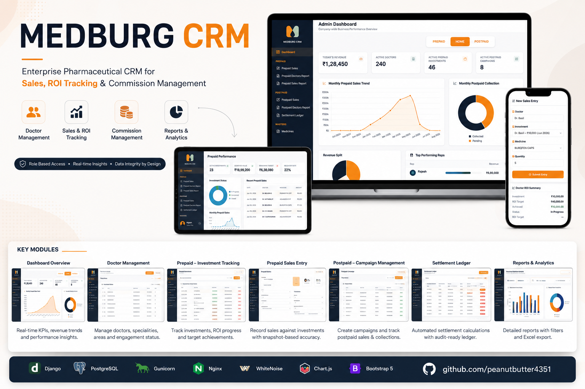

# Medburg CRM
### Enterprise Pharmaceutical CRM for Sales, ROI Tracking & Commission Management

> A production-grade Pharmaceutical Customer Relationship Management (CRM) platform built from scratch to streamline doctor engagement, sales operations, investment tracking, commission management, business analytics, and enterprise reporting.

---

## Project at a Glance

| | |
|------|------|
| **Industry** | Pharmaceutical |
| **Architecture** | Full Stack Web Application |
| **Backend** | Django |
| **Database** | PostgreSQL |
| **Deployment** | Ubuntu VPS |
| **Application Server** | Gunicorn |
| **Reverse Proxy** | Nginx |
| **Static File Pipeline** | WhiteNoise |
| **Authentication** | Role-Based |
| **Reporting** | Excel Export |
| **Current Release** | v1.2.3 |
| **Production Status** | Live Deployment |

---

## Engineering Case Study

This repository showcases the complete engineering journey behind **Medburg CRM** — from understanding the business problem to designing the architecture, implementing financial workflows, deploying to a production VPS, and maintaining multiple production releases.

> **Looking for the production source code?**
>
> **Production Repository:** https://github.com/peanutbutter4351/medburg-crm
