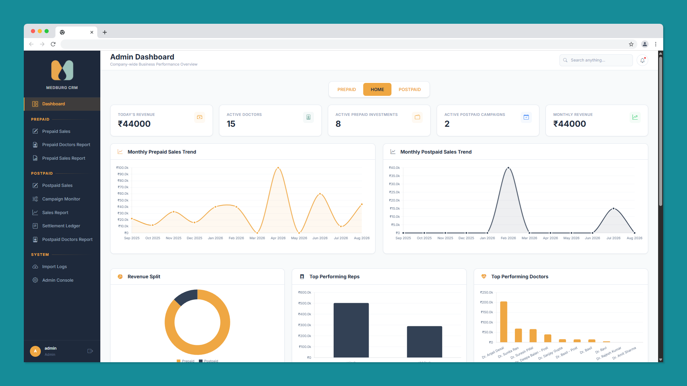
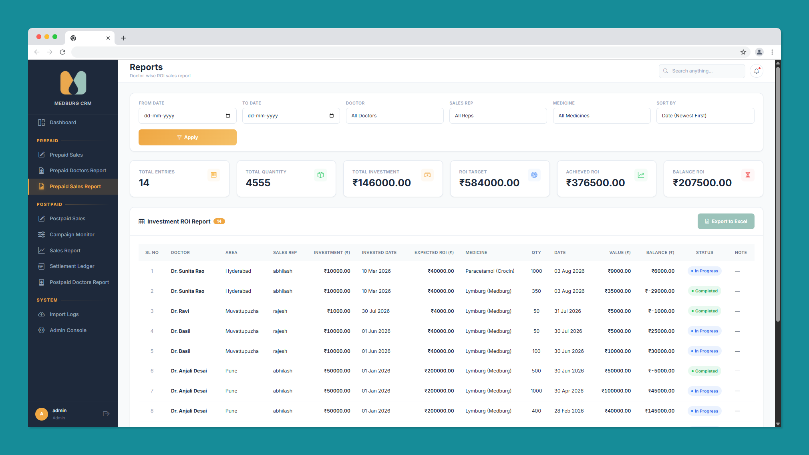
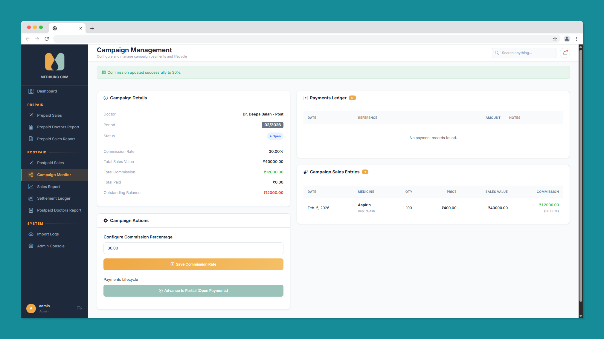
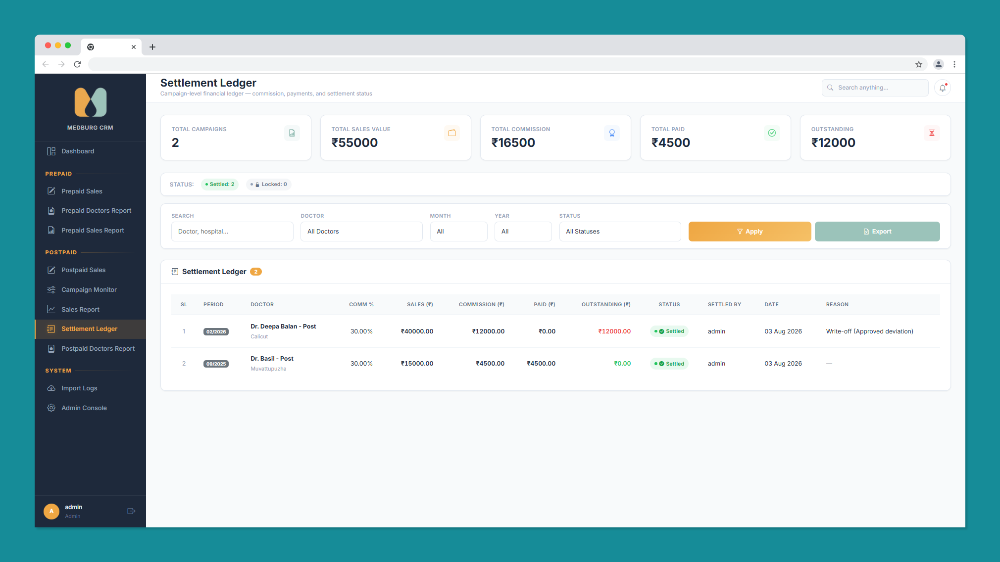
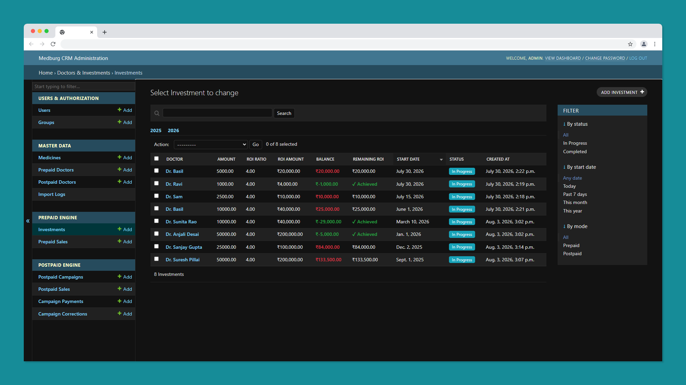

# Medburg CRM
### Enterprise Pharmaceutical CRM for Sales, ROI Tracking & Commission Management

> Medburg CRM is a production-ready Pharmaceutical Customer Relationship Management platform designed to simplify doctor engagement, sales operations, ROI tracking, commission management, and enterprise reporting through a unified workflow.

---

  

---

## Project Snapshot

| Attribute | Value |
|------|------|
| **Industry** | Pharmaceutical |
| **Architecture** | Full Stack Web Application |
| **Backend** | Django |
| **Database** | PostgreSQL |
| **Deployment** | Ubuntu VPS |
| **Application Server** | Gunicorn |
| **Reverse Proxy** | Nginx |
| **Static File Pipeline** | WhiteNoise |
| **Authentication** | Role-Based |
| **Reporting** | Excel Export |
| **Current Release** | v1.3.0 |
| **Production Status** | Live Deployment |

---

## Highlights

- Production-deployed enterprise CRM
- Snapshot-based ROI accounting system
- Dual financial workflows (Prepaid & Postpaid)
- Interactive analytics dashboard
- Excel reporting and exports
- Role-based authentication
- Semantic versioning with release candidates
- Production VPS deployment using Gunicorn & Nginx

---

# The Business Problem

Many small and mid-sized pharmaceutical distributors still rely on spreadsheets, paper records, and disconnected software to manage their day-to-day sales operations.

This often results in:

- Difficulty tracking doctor relationships and product promotions
- Manual ROI calculations for prepaid investments
- Complex commission calculations for postpaid campaigns
- Lack of centralized sales reporting
- Limited business visibility for management
- Time-consuming Excel-based workflows prone to human error

As the business grows, these disconnected processes become increasingly difficult to maintain, making financial reconciliation and performance tracking both slow and error-prone.

---

# The Solution

Medburg CRM was designed as a centralized platform that digitizes pharmaceutical sales operations while preserving financial accuracy and operational transparency.

The system provides dedicated workflows for both prepaid investment tracking and postpaid commission campaigns, enabling representatives and administrators to manage doctor relationships, sales entries, settlements, and business analytics through a unified interface.

Rather than replacing business processes, the CRM was designed to model and automate the existing operational workflow while maintaining complete auditability of financial records.

---

# Users

The CRM supports multiple user roles, each with dedicated workflows and permissions.

| Role | Responsibilities |
|------|------------------|
| **Administrator** | Manage doctors, medicines, representatives, campaigns, investments, reports, settlements, dashboards, and overall business operations. |
| **Sales Representative** | Record sales, manage assigned doctors, monitor active investments, and submit daily field activities. |
| **Management** | Monitor company-wide KPIs, revenue trends, representative performance, ROI tracking, and business reports. |

---

# Core Modules

| Module | Purpose |
|---------|---------|
| Dashboard | Company-wide KPIs and business analytics |
| Doctor Management | Manage prepaid and postpaid doctors |
| Medicine Management | Centralized medicine catalog |
| Sales Entry | Record prepaid and postpaid sales |
| Investment Lifecycle | Track ROI-based prepaid investments |
| Campaign Management | Configure postpaid commission campaigns |
| Settlement Ledger | Financial reconciliation and payment tracking |
| Reports | Interactive reports with Excel exports |
| User Management | Role-based authentication and authorization |

## Dashboard Overview
Real-time business analytics showing revenue trends, investment activity, doctor performance, and sales insights for administrators.

  

## ROI Tracking
Snapshot-based prepaid investment tracking with frozen pricing, recovery monitoring, and Excel-ready reporting.

  

## Campaign Monitor
Commission lifecycle management for postpaid campaigns, including outstanding balances and payment workflows.

  

## Settlement Ledger
Centralized financial reconciliation system for campaign settlements, payment history, and outstanding commission tracking.

  

## Admin Console
Customized Django administration interface for secure management of users, medicines, campaigns, investments, and operational data.

  

---

## Engineering Journey

This repository showcases the complete engineering journey behind **Medburg CRM** — from understanding the business problem to designing the architecture, implementing financial workflows, deploying to a production VPS, and maintaining multiple production releases.

> **Looking for the production source code?**
>
> **Production Repository**
>
> https://github.com/peanutbutter4351/medburg-crm
